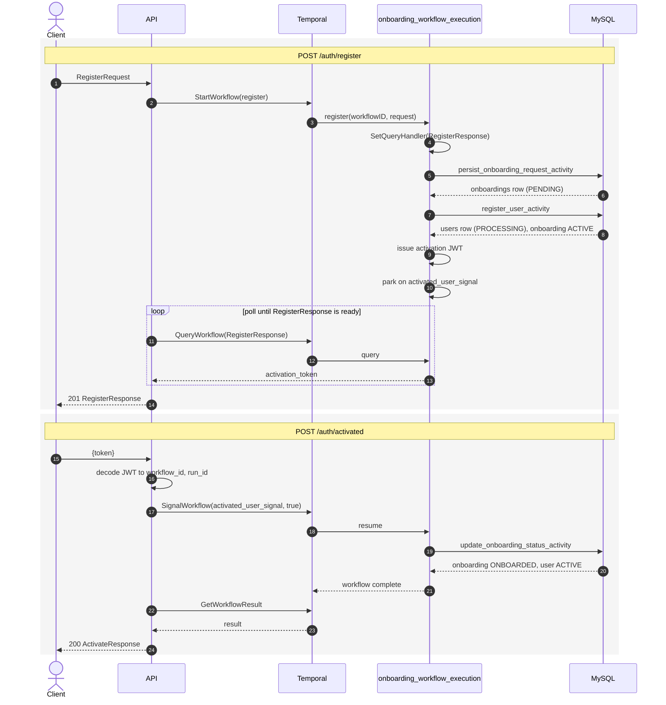

# onboard-be

Sample backend that replicates memograph's **Register + Activation** Temporal workflow using [go-cook](https://github.com/RandySteven/go-cook), with **MySQL** instead of Postgres.

The HTTP API starts a Temporal workflow that:

1. Persists an `onboardings` row
2. Creates a `users` row and returns an activation token
3. Parks until `POST /auth/activated` signals the workflow
4. Marks onboarding `ONBOARDED` and the user `ACTIVE`

## Requirements

- Go 1.26.1+
- MySQL 8+ and Temporal (`temporal server start-dev`, or Docker Compose)

## Setup

You need **MySQL** and **Temporal**. Either Docker or local installs work.

### Option A — Docker

```bash
docker compose up -d
docker compose ps
```

### Option B — local MySQL + Temporal CLI (what this machine uses)

```bash
brew services start mysql
mysql -uroot -e "ALTER USER 'root'@'localhost' IDENTIFIED BY 'root'; CREATE DATABASE IF NOT EXISTS onboard CHARACTER SET utf8mb4 COLLATE utf8mb4_unicode_ci;"
# Temporal CLI already listening on :7233 is enough (namespace: default)
```

Then from `onboard-be/`:

```bash
go run ./cmd/migration --config ./files/yaml/app.local.yml
go run ./cmd/main --config ./files/yaml/app.local.yml
```

Makefile shortcuts: `make up`, `make migrate`, `make run`.

Local defaults (see `files/yaml/app.local.yml`):

| Service | Address |
| --- | --- |
| API | http://localhost:8080 |
| MySQL | `root:root@127.0.0.1:3306/onboard` |
| Temporal | localhost:7233 |
| Temporal UI | http://localhost:8088 |

`go-cook`'s `NewMYSQLClient` currently builds a Postgres-style DSN and does not register `github.com/go-sql-driver/mysql`. This service uses go-cook's `DBClient`, `Save`/`Update`, and `MigrationWorker`, but opens MySQL with a standard `user:pass@tcp(host)/db` DSN in `apps/mysql.go`.

## Endpoints

### `POST /auth/register`

Creates the onboarding + user records, then returns before activation.

```bash
curl -s -X POST http://localhost:8080/auth/register \
  -H 'Content-Type: application/json' \
  -d '{
    "first_name": "Randy",
    "last_name": "Steven",
    "email": "randy@example.com",
    "username": "randy",
    "password": "secret123",
    "phone_number": "08123456789",
    "address": "Jakarta",
    "register_as": "USER",
    "additional_info": { "occupation": "engineer" }
  }'
```

Response includes `activation_token`. Copy it for the next call.

### `POST /auth/activated`

Signals the parked workflow and waits until it completes.

```bash
curl -s -X POST http://localhost:8080/auth/activated \
  -H 'Content-Type: application/json' \
  -d '{"token":"<activation_token>"}'
```

### `GET /health`

Returns `{"status":"ok"}`.

## Workflow

Same go-cook pattern as memograph's `logic/onboarding`:

- `AddResumableTransitionActivityWithOptions` for persist → register user → update status
- `ApprovalSignal: activated_user_signal` after `register_user_activity`
- Register handler polls `RegisterResponse` until the activation token is ready
- Activate handler decodes the JWT and `SignalWorkflow(..., true)`



This sample only supports `register_as: USER`. Vendor/boutique branches can be added later the same way memograph does.
